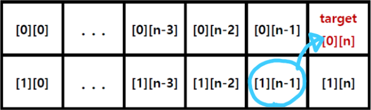
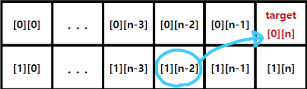

# BOJ-S1-9465-스티커

[문제링크](https://www.acmicpc.net/problem/9465)

### 분류

다이나믹 프로그래밍

### 접근법




- 이미지와 같이 스티커 길이가 3 이상일 경우 두가지로 분기한 경우를 생각하면 된다.

### Code

```python
import sys
input = sys.stdin.readline

t = int(input())

for tc in range(t):
    n = int(input())
    score = [list(map(int, input().split())) for _ in range(2)]

    DP = [[0] * n for _ in range(2)]

    # 스티커 길이가 1일 경우
    DP[0][0] = score[0][0]  # 위쪽 행
    DP[1][0] = score[1][0]  # 아래쪽 행
    if n == 1:
        print(max(DP[0][0], DP[1][0]))
        continue
    # print(DP)

    # 스티커 길이가 2일 경우
    DP[0][1] = score[1][0] + score[0][1]  # 위쪽 행
    DP[1][1] = score[0][0] + score[1][1]  # 아래쪽 행
    if n == 2:
        print(max(DP[0][1], DP[1][1]))
        continue
    # print(DP)

    # 스티커 길이가 3이상일 경우
    for i in range(2, n):
        # 한 행을 건너뛰고 더하는방법, 한 행씩 더하는 방법을 비교한다.
        DP[0][i] = max(DP[1][i - 2], DP[1][i - 1]) + score[0][i]
        DP[1][i] = max(DP[0][i - 2], DP[0][i - 1]) + score[1][i]

    print(max(DP[0][n-1], DP[1][n-1]))
```
